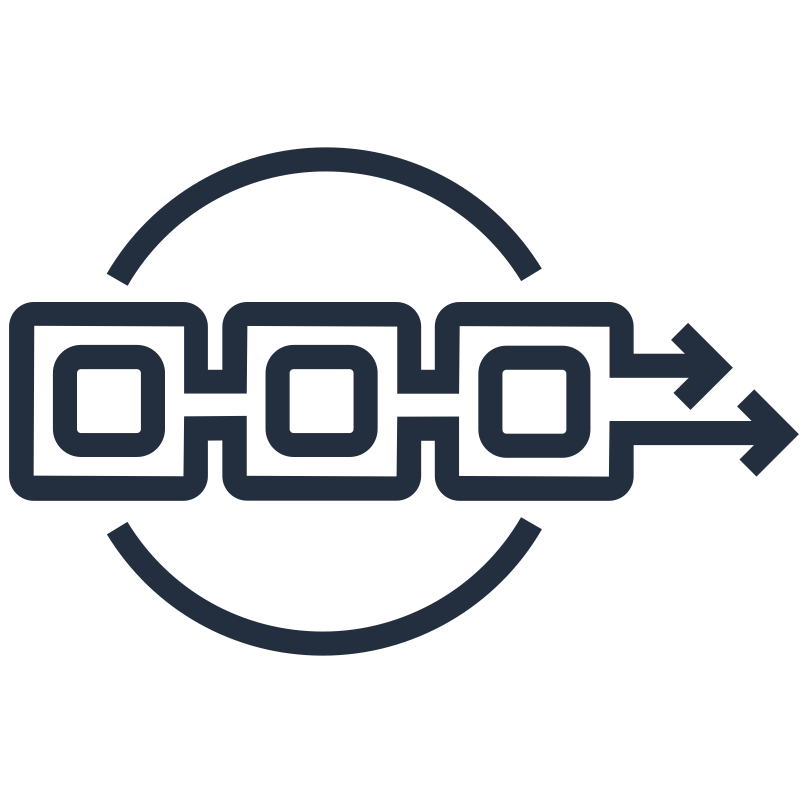

# Amazon Managed Blockchain Workshop

## Building and deploying an application for Hyperledger Fabric on Amazon Managed Blockchain

This workshop builds a Hyperledger Fabric blockchain network using Amazon Managed Blockchain. Once the Fabric network has been created, you will deploy a 3-tier application that uses the Fabric network to track donations to a non-profit organisation, and track how those donations are spent by the non-profit. Donations 
and spending are tracked on a Hyperledger Fabric blockchain network with both donors and non-profits 
(NGO's) being members of the network. The 3-tier application consists of the following components:

* Node.js / Angular user interface application, accessing services provided by a RESTful API
* RESTful API, running as a Node.js Express application, using the Hyperledger Fabric Client SDK to query 
and invoke chaincode
* Fabric Chaincode, written in Node.js, deployed to a Hyperledger Fabric network

This workshop will build a Hyperledger Fabric blockchain network using Amazon Managed Blockchain, deploy the chaincode,
start the RESTful API server and finally run a UI application that uses the RESTful API to interact with the Fabric
network. The workshop is divided into four parts:

1. Building a Hyperledger Fabric blockchain network using Amazon Managed Blockchain. Instructions can be found in the folder: [ngo-fabric](ngo-fabric)
2. Deploying the chaincode, or smart contract, that provides the donation and spend tracking functionality. Instructions can be found in the folder: [ngo-chaincode](ngo-chaincode)
3. Starting the RESTful API server that exposes the chaincode functions to client applications. Instructions can be found in the folder: [ngo-rest-api](ngo-rest-api)
4. Running the User Interface application. Instructions can be found in the folder: [ngo-ui](ngo-ui)

## Getting started

To build the network, deploy the chaincode, start the RESTful API server and run the application, follow the 
README instructions in parts 1-4, in this order:

* [Part 1:](ngo-fabric/README.md) Start the workshop by building the Hyperledger Fabric blockchain network using Amazon Managed Blockchain.
* [Part 2:](ngo-chaincode/README.md) Deploy the non-profit chaincode. 
* [Part 3:](ngo-rest-api/README.md) Run the RESTful API server. 
* [Part 4:](ngo-ui/README.md) Run the application. 

## License

This library is licensed under the Apache 2.0 License. 
