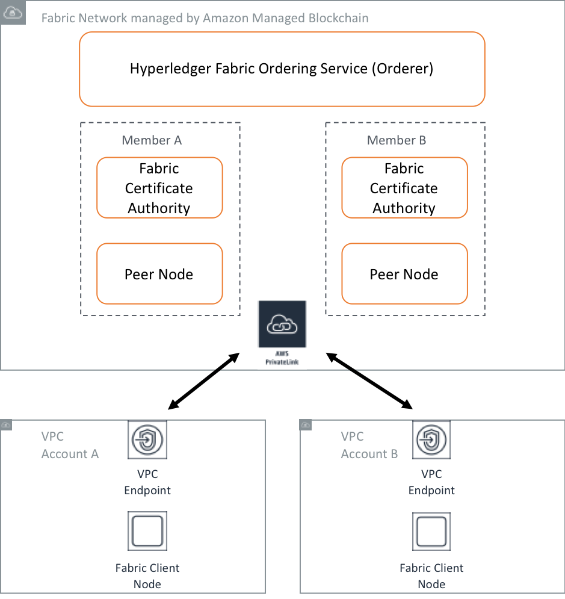

# Part 5: Adding a new member to a Fabric network on Amazon Managed Blockchain

Part 5 will help you to add a new member running in a different AWS Account to the Fabric network you created in [Part 1](../ngo-fabric/README.md). After adding the new member you will create a peer node for the member and join the peer
node to the channel created in [Part 1](../ngo-fabric/README.md). The new peer node will receive the blocks that exist
on the new channel and will build its own copy of the ledger. We will also configure the Fabric network so the new
member can take part in endorsing transactions.

The architecture of a multi-member Fabric network on Amazon Managed Blockchain is shown in the figure below.



Adding a new member to an existing Fabric network involves a number of steps. The new member will be located in a different AWS account, and the steps therefore involve cooperation between Fabric administrators in the existing account (let’s call this Account A, where the Fabric network was originally created), and the new account (let’s call this Account B, where the new member will be created). The steps look as follows:

1.	Account A invites Account B to join the Fabric network
2.	Account B creates a member in the Fabric network
3.	Account B creates a peer node
4.  Account B creates a Fabric client node
5.  Account B prepares the Fabric client node and enrolls an identity
6.  Account B shares the public keys for its member with Account A
7.  Account A creates an MSP folder for the new Account B member
8.  Account A creates a configtx.yaml which includes the new Account B member
9.  Account A generates a channel configuration
10. Endorsing peers sign the new channel configuration
11. Account A updates the channel with the new configuration
12. Account A shares the genesis block for the channel with Account B
13. Account B starts its peer node and joins the channel
14. Account B installs chaincode
15. Account B queries the chaincode
16. Account B invokes a transaction
17. Account A updates the endorsement policy for the chaincode on the channel
18. Account B installs the latest version of the chaincode

## Two scenarios involving new members
There are two potential scenarios when adding new members to an existing Fabric network:

### The new member joins an existing channel
In this case, the member needs to be added to the channel configuration for an existing channel. To do this, follow all of the steps in this README.

### A new channel is created with both new members and existing members
In this case a new channel configuration can be created which contains both new and existing members. This configuration can be used to create a new channel. To do this, follow these steps in this README:

* Steps 1-9 
* Step 12b
* Steps 13-16

This scenario is simpler as it does not involve updating the existing channel configuration.

## Pre-requisites - Account A, the network creator
There are multiple parts to the workshop. Before starting on Part 5, a network creator should have completed [Part 1](../ngo-fabric/README.md). You need an existing Fabric network before starting Part 5. The network creator would have also created a peer node under a member belonging to Account A.

In the AWS account where you create the [Part 1](../ngo-fabric/README.md) Fabric network, use Cloud9 to SSH into the Fabric client node. The key (i.e. the .PEM file) should be in your home directory. The DNS of the Fabric client node EC2 instance can be found in the output of the CloudFormation stack you created in [Part 1](../ngo-fabric/README.md)

```
ssh ec2-user@<dns of EC2 instance> -i ~/<Fabric network name>-keypair.pem
```

You should have already cloned this repo in [Part 1](../ngo-fabric/README.md)

```
cd ~
git clone https://github.com/aws-samples/non-profit-blockchain.git
```

You will need to set the context before carrying out any Fabric CLI commands. We do this 
using the export files that were generated for us in [Part 1](../ngo-fabric/README.md)

Source the file, so the exports are applied to your current session. If you exit the SSH 
session and re-connect, you'll need to source the file again. The `source` command below
will print out the values of the key ENV variables. Make sure they are all populated. If
they are not, follow Step 4 in [Part 1](../ngo-fabric/README.md) to repopulate them:

```
cd ~/non-profit-blockchain/ngo-fabric
source fabric-exports.sh
```

Check the peer export file exists and that it contains a number of export keys with values:

```
cat ~/peer-exports.sh 
```
If the file has values for all keys, source it:

```
source ~/peer-exports.sh 
```

## Pre-requisites - Account B
We will use Cloud9 to provide a Linux terminal which has the AWS CLI already installed.

1. Spin up a [Cloud9 IDE](https://us-east-1.console.aws.amazon.com/cloud9/home?region=us-east-1) from the AWS console.
In the Cloud9 console, click 'Create Environment'. Using 'us-east-1' for the region will be easier.
2. Provide a name for your environment, e.g. fabric-c9, and click **Next Step**
3. Select `Other instance type`, then select `t2-medium` and click **Next Step**
4. Click **Create environment**. It would typically take 30-60s to create your Cloud9 IDE
5. In the Cloud9 terminal, in the home directory, clone this repo:

```
cd ~
git clone https://github.com/aws-samples/non-profit-blockchain.git
```

Update your AWS CLI to the latest version.

```
sudo pip install awscli --upgrade
```

## Step 1: Account A invites Account B to join the Fabric network
In the Amazon Managed Blockchain Console: https://console.aws.amazon.com/managedblockchain

The Fabric administrator for Account A invites another AWS account to join the Fabric network. In the Managed Blockchain console, select your Fabric network and click the ‘Invite account’ button. Enter the 12-digit AWS account number of the account you wish to invite. You should see a confirmation message indicating your invitation has been sent successfully.

## Step 2: Account B creates a member in the Fabric network
In the Amazon Managed Blockchain Console: https://console.aws.amazon.com/managedblockchain

A user logged in to Account B can view the invitation in the Managed Blockchain console. Clicking on the network name will show the details of the network that Account B has been invited to join. Click ‘Create member’ to create a member in the network, entering a unique member name and an administrator username and password for the member. Make a note of the administrator username and password as you will need them later.

## Step 3: Account B creates a peer node
In the Amazon Managed Blockchain Console: https://console.aws.amazon.com/managedblockchain

Once the Fabric network and member for Account B have an ACTIVE status, it’s time to create a Fabric peer node. Each member on a network creates their own peer nodes, so select the member you created above and click the link to create a peer node. Select an instance type, the amount of storage for the node, and create the peer node.

## Step 4: Account B creates a Fabric client node
These steps are identical to those performed by Account A when the Fabric network was originally created. See Step 3 in [Part 1:](../ngo-fabric/README.md). The steps have been replicated below.

In your Cloud9 terminal window.

Create the Fabric client node, which will host the Fabric CLI. You will use the CLI to administer
the Fabric network. The Fabric client node will be created in its own VPC, with VPC endpoints 
pointing to the Fabric network created by the network creator in [Part 1](../ngo-fabric/README.md). 
CloudFormation will be used to create the Fabric client node, the VPC and the VPC endpoints.

The CloudFormation template requires a number of parameter values. We'll make sure these 
are available as export variables before running the script below. You can obtain these values
from the Amazon Managed Blockchain Console.

In Cloud9:

```
export REGION=us-east-1
export NETWORKID=<the network ID created by the network creator, from the Amazon Managed Blockchain Console>
export NETWORKNAME=<the name of the network>
```

Set the VPC endpoint. Make sure it has been populated and exported. If the `echo` statement below shows
that it's blank, check the details under your network in the Amazon Managed Blockchain Console: 

```
export VPCENDPOINTSERVICENAME=$(aws managedblockchain get-network --region $REGION --network-id $NETWORKID --query 'Network.VpcEndpointServiceName' --output text)
echo $VPCENDPOINTSERVICENAME
```

If the VPC endpoint is populated with a value, go ahead and run this script. This will create the
CloudFormation stack. You will see an error saying `key pair does not exist`. This is expected as the script
will check whether the keypair exists before creating it. I don't want to overwrite any existing
keypairs you have, so just ignore this error and let the script continue:

```
cd ~/non-profit-blockchain/ngo-fabric
./vpc-client-node.sh
```

Check the progress in the AWS CloudFormation console and wait until the stack is CREATE COMPLETE.
You will find some useful information in the Outputs tab of the CloudFormation stack once the stack
is complete. We will use this information in later steps.

## Step 5: Account B prepares the Fabric client node and enrolls an identity
On the Fabric client node.

Prior to executing any commands in the Fabric client node, you will need to export ENV variables
that provide a context to Hyperledger Fabric. These variables will tell the client node which peer
node to interact with, which TLS certs to use, etc. 

From Cloud9, SSH into the Fabric client node. The key (i.e. the .PEM file) should be in your home directory. 
The DNS of the Fabric client node EC2 instance can be found in the output of the CloudFormation stack you 
created in Step 3 above.

Answer 'yes' if prompted: `Are you sure you want to continue connecting (yes/no)`

```
cd ~
ssh ec2-user@<dns of EC2 instance> -i ~/<Fabric network name>-keypair.pem
```

Clone the repo:

```
cd ~
git clone https://github.com/aws-samples/non-profit-blockchain.git
```

Create the file that includes the ENV export values that define your Fabric network configuration.

```
cd ~/non-profit-blockchain/ngo-fabric
cp templates/exports-template.sh fabric-exports.sh
vi fabric-exports.sh
```

Update the export statements at the top of the file. The info you need can be found 
in the Amazon Managed Blockchain Console, under your network. The member details you use, and 
the admin username and password, are the ones you entered when creating your member.

Source the file, so the exports are applied to your current session. If you exit the SSH 
session and re-connect, you'll need to source the file again.

```
cd ~/non-profit-blockchain/ngo-fabric
source fabric-exports.sh
```

Sourcing the file will do two things:
* export the necessary ENV variables
* create another file which contains the export values you need to use when working with a Fabric peer node.
This can be found in the file: `~/peer-exports.sh`. You will see how to use this in a later step.

Check the `source` worked:

```
$ echo $PEERSERVICEENDPOINT
nd-4MHB4EKFCRF7VBHXZE2ZU4F6GY.m-B7YYBFY4GREBZLPCO2SUS4GP3I.n-WDG36TTUD5HEJORZUPF4REKMBI.managedblockchain.us-east-1.amazonaws.com:30003
```

Check the peer export file exists and that it contains a number of export keys with values:

```
cat ~/peer-exports.sh 
```

If the file has values for all keys, source it:

```
source ~/peer-exports.sh 
```

Get the latest version of the Managed Blockchain PEM file. This will overwrite the existing file in the home directory with the latest version of this file:

```
aws s3 cp s3://us-east-1.managedblockchain/etc/managedblockchain-tls-chain.pem  /home/ec2-user/managedblockchain-tls-chain.pem
```

Enroll an admin identity with the Fabric CA (certificate authority). We will use this
identity to administer the Fabric network and perform tasks such as creating channels
and instantiating chaincode.

```
export PATH=$PATH:/home/ec2-user/go/src/github.com/hyperledger/fabric-ca/bin
cd ~
fabric-ca-client enroll -u https://$ADMINUSER:$ADMINPWD@$CASERVICEENDPOINT --tls.certfiles /home/ec2-user/managedblockchain-tls-chain.pem -M /home/ec2-user/admin-msp 
```

Some final copying of the certificates is necessary:

```
mkdir -p /home/ec2-user/admin-msp/admincerts
cp ~/admin-msp/signcerts/* ~/admin-msp/admincerts/
```

## Step 6: Account B shares the public keys for its member with Account A
On the Fabric client node in Account B.

Account B needs to share two certificates with Account A:

* the admin cert, stored in /home/ec2-user/admin-msp/admincerts
* the root CA cert, store in /home/ec2-user/admin-msp/cacerts 

Information will be shared via S3. Account B will copy the certs to S3, and Account A will fetch them from S3.

Update the region and member ID in the following script. The member ID is the ID of the new member in Account B:

```
cd ~/non-profit-blockchain
vi new-member/s3-handler.sh 
```

Copy the Account B public keys to S3:

```bash
cd ~/non-profit-blockchain
./new-member/s3-handler.sh createS3BucketForNewMember
./new-member/s3-handler.sh copyCertsToS3
```

## Step 7: Account A creates an MSP folder for the new Account B member 
On the Fabric client node in Account A.

Account A stores the certificates provided by Account B on its Fabric client node. The script below will create a new MSP directory for the Account B member on the Account A Fabric client node.

Update the region and member ID in the following script. The member ID is the ID of the new member in Account B, so this 
file should look identical to the one created in the previous step:

```
cd ~/non-profit-blockchain
vi new-member/s3-handler.sh 
```

Copy the Account B public keys from S3 to the MSP directory on the Fabric client node in Account A:

```
cd ~/non-profit-blockchain
./new-member/s3-handler.sh copyCertsFromS3
```

Check the new MSP directory. The directory name will be the lowercase member ID:

```
ls -l ~
```

## Step 8: Account A creates a configtx.yaml which includes the new Account B member
On the Fabric client node in Account A.

The configtx.yaml file contains details of the organisations in a Fabric network as well as channel configuration profiles that can be used when creating new channels. The channel creator originally created this file just before creating the channel. The channel creator now needs to add the new member to this file.

You will find the file to be edited in the home directory of the Fabric client node:

```
vi ~/configtx.yaml
```

You will make two changes to the file. A working example of the updated configtx.yaml file can be found below the template example below:

1. Add Org2 (or Org3, Org4, etc. - just copy &Org2 under Organizations from the template below), replacing `Member2ID` with the ID of the new member from Account B as copied directly from the Amazon Managed Blockchain console. For the MSPDir, `Member2ID` must be replaced by a lowercase member ID. Instead of typing this, you can copy it from the Fabric client node in Account A, where you created the MSP dir in Step 7. Enter: `ls ~` and find the directory with your lower case member ID. The end result of the MSPDir in configtx.yaml should look as follows: `MSPDir: /opt/home/m-trd4xpjborem7bdmbv6wlg3nkm-msp`
2. Add the TwoOrgChannel under Organizations, under Profiles, at the end of the file.

Save the file.

### Important

This file is sensitive and must be indented properly. Artifacts from pasting can cause the file to fail with marshalling errors. We recommend using emacs to edit it. You can also use VI, but before making any changes in VI, enter `:set paste`, press i to enter insert mode, paste the contents, press escape, and then enter `:set nopaste` before saving.

### Template for configtx.yaml

```
################################################################################
#
#   Section: Organizations
#
#   - This section defines the different organizational identities which will
#   be referenced later in the configuration.
#
################################################################################
Organizations:
    - &Org1
            # member id defines the organization
        Name: Member1ID
            # ID to load the MSP definition as
        ID: Member1ID
            #msp dir of org1 in the docker container
        MSPDir: /opt/home/admin-msp
            # AnchorPeers defines the location of peers which can be used
            # for cross org gossip communication.  Note, this value is only
            # encoded in the genesis block in the Application section context
        AnchorPeers:
            - Host:
              Port:
    - &Org2
        Name: Member2ID
        ID: Member2ID
        MSPDir: /opt/home/Member2ID-msp
        AnchorPeers:
            - Host:
              Port:

################################################################################
#
#   SECTION: Application
#
#   - This section defines the values to encode into a config transaction or
#   genesis block for application related parameters
#
################################################################################
Application: &ApplicationDefaults
        # Organizations is the list of orgs which are defined as participants on
        # the application side of the network
     Organizations:

################################################################################
#
#   Profile
#
#   - Different configuration profiles may be encoded here to be specified
#   as parameters to the configtxgen tool
#
################################################################################
Profiles:
    OneOrgChannel:
        Consortium: AWSSystemConsortium
        Application:
            <<: *ApplicationDefaults
            Organizations:
                - *Org1
    TwoOrgChannel:
        Consortium: AWSSystemConsortium
        Application:
            <<: *ApplicationDefaults
            Organizations:
                - *Org1
                - *Org2
```

### Working example of a complete configtx.yaml

```
################################################################################
#
#   Section: Organizations
#
#   - This section defines the different organizational identities which will
#   be referenced later in the configuration.
#
################################################################################
Organizations:
    - &Org1
        Name: m-TEW3EJGTPBBW7BMGXYOIXV5364

        # ID to load the MSP definition as
        ID: m-TEW3EJGTPBBW7BMGXYOIXV5364

        MSPDir: /opt/home/admin-msp

        AnchorPeers:
            # AnchorPeers defines the location of peers which can be used
            # for cross org gossip communication.  Note, this value is only
            # encoded in the genesis block in the Application section context
            - Host: 
              Port: 

    - &Org2
        Name: m-TRD4XPJBOREM7BDMBV6WLG3NKM
        ID: m-TRD4XPJBOREM7BDMBV6WLG3NKM
        MSPDir: /opt/home/m-trd4xpjborem7bdmbv6wlg3nkm-msp
        AnchorPeers:
            - Host:
              Port:

################################################################################
#
#   SECTION: Application
#
#   - This section defines the values to encode into a config transaction or
#   genesis block for application related parameters
#
################################################################################
Application: &ApplicationDefaults

    # Organizations is the list of orgs which are defined as participants on
    # the application side of the network
    Organizations:

################################################################################
#
#   Profile
#
#   - Different configuration profiles may be encoded here to be specified
#   as parameters to the configtxgen tool
#
################################################################################
Profiles:
    OneOrgChannel:
        Consortium: AWSSystemConsortium
        Application:
            <<: *ApplicationDefaults
            Organizations:
                - *Org1
    TwoOrgChannel:
        Consortium: AWSSystemConsortium
        Application:
            <<: *ApplicationDefaults
            Organizations:
                - *Org1
                - *Org2
```

## Step 9: Account A generates a channel configuration
On the Fabric client node in Account A.

This step generates a new channel configuration block that includes the new member owned by Account B. A configuration block is similar to the genesis block, defining the members and policies for a channel. In fact, you can consider a configuration block to be the genesis block plus the delta of configuration changes that have occurred since the channel was created. 

For interest, 'genesis block' appears in two places in Fabric:
>   1) The orderer is bootstrapped using a genesis block, which is used to create the orderer system channel. The genesis block is created using this command: `configtxgen -outputBlock`, and is passed to the orderer on startup, usually via an ENV variable or parameter (named `General.GenesisFile`). The system channel name defaults to 'testchainid' unless you override it.
>   2) Application channels are created using a channel configuration block. The first of these becomes the genesis block for the channel. This is created using this command: `configtxgen -outputCreateChannelTx`.

A new channel configuration block is created by fetching the latest configuration block from the channel, generating a new channel configuration, then comparing the old and new configurations to generate a 'diff'. 

Generating a new channel configuration involves a number of steps, which we will work through below.

### Generate new configtx.yaml channel creation configuration
Generate the configtx channel creation configuration by executing the following script:

```
docker exec cli configtxgen -outputCreateChannelTx /opt/home/$CHANNEL-two-org.pb -profile TwoOrgChannel -channelID $CHANNEL --configPath /opt/home/
```

You should see:

```
2018-11-26 21:41:22.885 UTC [common/tools/configtxgen] main -> INFO 001 Loading configuration
2018-11-26 21:41:22.887 UTC [common/tools/configtxgen] doOutputChannelCreateTx -> INFO 002 Generating new channel configtx
2018-11-26 21:41:22.887 UTC [common/tools/configtxgen/encoder] NewApplicationGroup -> WARN 003 Default policy emission is deprecated, please include policy specificiations for the application group in configtx.yaml
2018-11-26 21:41:22.887 UTC [common/tools/configtxgen/encoder] NewApplicationOrgGroup -> WARN 004 Default policy emission is deprecated, please include policy specificiations for the application org group m-BHX24CQGP5CUNFS3YZTO2MPSRI in configtx.yaml
2018-11-26 21:41:22.888 UTC [common/tools/configtxgen] doOutputChannelCreateTx -> INFO 005 Writing new channel tx
```

Check that the channel configuration has been generated:

```
ls -lt ~/$CHANNEL-two-org.pb
```

### Print the new member configuration
Generate a member definition for the new member. It reads the information for the member from configtx.yaml, created in the previous step. Replace the value of NEWMEMBERID below:

First, export the new member id, from Account B:

```
export NEWMEMBERID=<Account B Member ID>
```

Then generate the new member config:

```
docker exec cli /bin/bash -c "configtxgen -printOrg $NEWMEMBERID --configPath /opt/home/ > /tmp/$NEWMEMBERID.json"
```

You should see:

```
2018-12-20 09:03:18.175 UTC [common/tools/configtxgen] main -> WARN 001 Omitting the channel ID for configtxgen is deprecated.  Explicitly passing the channel ID will be required in the future, defaulting to 'testchainid'.
2018-12-20 09:03:18.175 UTC [common/tools/configtxgen] main -> INFO 002 Loading configuration
2018-12-20 09:03:18.177 UTC [common/tools/configtxgen/encoder] NewOrdererOrgGroup -> WARN 003 Default policy emission is deprecated, please include policy specificiations for the orderer org group m-TRD4XPJBOREM7BDMBV6WLG3NKM in configtx.yaml
```

Check that the new member configuration has been generated and that is has more than 0 bytes:

```
$ docker exec cli ls -lt /tmp/$NEWMEMBERID.json    
-rw-r--r-- 1 root root 4678 Dec 20 09:03 /tmp/m-TRD4XPJBOREM7BDMBV6WLG3NKM.json 
```

### Fetch the latest configuration block from the channel
The channel creation block for the channel was created in [Part 1:](../ngo-fabric/README.md), but just in case the configuration was updated at some point, we will pull the latest version of the config block directly from the channel. 

```
docker exec -e "CORE_PEER_TLS_ENABLED=true" -e "CORE_PEER_TLS_ROOTCERT_FILE=/opt/home/managedblockchain-tls-chain.pem"  \
    -e "CORE_PEER_ADDRESS=$PEER" -e "CORE_PEER_LOCALMSPID=$MSP" -e "CORE_PEER_MSPCONFIGPATH=$MSP_PATH" \
    cli peer channel fetch config /opt/home/fabric-samples/chaincode/hyperledger/fabric/peer/$CHANNEL.config.block \
    -c $CHANNEL -o $ORDERER --cafile /opt/home/managedblockchain-tls-chain.pem --tls   
```

Check that the latest config block file exists. The latest config block will be called $CHANNEL.config.block, whereas the original config block (used to create the genesis block) will be called $CHANNEL.block:

```
ls -lt /home/ec2-user/fabric-samples/chaincode/hyperledger/fabric/peer
```

### Create an updated channel config including the new member
We will use a bash script to create an updated channel config since the process involves quite a few steps. We need to execute the bash script in the CLI container, so we copy it to the home directory on the Fabric client node, as this is mounted into the CLI container.

```
cd ~/non-profit-blockchain/new-member
cp create-config-update.sh ~
```

A utility program called 'configtxlator' is used to create the new channel config - it translates the JSON channel configurations to/from binary protobuf structures. 'configtxlator' can run as a REST API server, so we start it in this mode since we need to make a few calls to it. 

Replace MEMBERID in the statement below with the member ID of the new member in Account B: 

```
docker exec -e "CHANNEL=mychannel" -e "MEMBERID=<Account B Member ID>" -e "BLOCKDIR=/opt/home/fabric-samples/chaincode/hyperledger/fabric/peer" cli /opt/home/create-config-update.sh
```

You should see:

```
$ docker exec -e "CHANNEL=mychannel" -e "MEMBERID=m-TRD4XPJBOREM7BDMBV6WLG3NKM" -e "BLOCKDIR=/opt/home/fabric-samples/chaincode/hyperledger/fabric/peer" cli /opt/home/create-config-update.sh
Creating config update payload for the new member 'm-TRD4XPJBOREM7BDMBV6WLG3NKM'
configtxlator_pid:983
Sleeping 5 seconds for configtxlator to start...
2018-12-20 09:15:42.578 UTC [configtxlator] startServer -> INFO 001 Serving HTTP requests on 0.0.0.0:7059
/tmp /opt/home
  % Total    % Received % Xferd  Average Speed   Time    Time     Time  Current
                                 Dload  Upload   Total   Spent    Left  Speed
100 43033    0 30048  100 12985   963k   416k --:--:-- --:--:-- --:--:--  978k
Checking whether member 'm-TRD4XPJBOREM7BDMBV6WLG3NKM' already exists in the channel config
About to execute jq '.channel_group.groups.Application.groups | contains({m-TRD4XPJBOREM7BDMBV6WLG3NKM})'
Member 'm-TRD4XPJBOREM7BDMBV6WLG3NKM' does not exist in the channel config. This is expected as we are about to add the member
  % Total    % Received % Xferd  Average Speed   Time    Time     Time  Current
                                 Dload  Upload   Total   Spent    Left  Speed
100 31213    0  8844  100 22369   432k  1093k --:--:-- --:--:-- --:--:-- 1149k
  % Total    % Received % Xferd  Average Speed   Time    Time     Time  Current
                                 Dload  Upload   Total   Spent    Left  Speed
100 40085    0 11271  100 28814   507k  1297k --:--:-- --:--:-- --:--:-- 1339k
  % Total    % Received % Xferd  Average Speed   Time    Time     Time  Current
                                 Dload  Upload   Total   Spent    Left  Speed
100 23284    0  2635  100 20649  44324   339k --:--:-- --:--:-- --:--:--  341k
  % Total    % Received % Xferd  Average Speed   Time    Time     Time  Current
                                 Dload  Upload   Total   Spent    Left  Speed
100  8926    0  6291  100  2635   327k   137k --:--:-- --:--:-- --:--:--  341k
  % Total    % Received % Xferd  Average Speed   Time    Time     Time  Current
                                 Dload  Upload   Total   Spent    Left  Speed
100  7651    0  2661  100  4990   137k   258k --:--:-- --:--:-- --:--:--  270k
Created config update payload for the new organization 'm-TRD4XPJBOREM7BDMBV6WLG3NKM', in file /opt/home/fabric-samples/chaincode/hyperledger/fabric/peer/m-TRD4XPJBOREM7BDMBV6WLG3NKM_config_update_as_envelope.pb
/opt/home
/opt/home/create-config-update.sh: line 92:   983 Terminated              configtxlator start
```

Check that the update channel config block file now exists. You should see the files below. You have just created the file ending in `config_update_as_envelope.pb`.

```
$ ls -lt /home/ec2-user/fabric-samples/chaincode/hyperledger/fabric/peer
total 36
-rw-r--r-- 1 root root  2661 Dec 20 10:41 m-TRD4XPJBOREM7BDMBV6WLG3NKM_config_update_as_envelope.pb
-rw-r--r-- 1 root root 12985 Dec 20 10:40 mychannel.config.block
-rw-r--r-- 1 root root 12985 Dec 13 06:44 mychannel.block
```

## Step 10: Endorsing peers must sign the new channel configuration
On the Fabric client node in Account A.

In this step, when we refer to 'diff', we mean the binary protobuf version of the 'diff' file, which we wrapped in an envelope in the final step in the script `create-config-update.sh`. This file is titled `<YOUR NEW MEMBER ID>_config_update_as_envelope.pb` in the previous step, and can be found by executing this command:

```
ls -lt /home/ec2-user/fabric-samples/chaincode/hyperledger/fabric/peer
```
 
The 'diff' created above must be signed by the existing network members, i.e. the network members must endorse the changes to the channel configuration and approve the new member joining the channel. A channel configuration update is really just another transaction in Fabric, known as a 'configuration transaction', and as such it must be endorsed by network members in accordance with the modification policy for the channel. The default modification policy for the channel Application group is MAJORITY, which means a majority of members need to sign the channel configuration update.

Since our network currently contains only one member, the network creator, this step isn't strictly required as only the network creator would need to sign the package. However, I've made it an explicit step as you will need it when your Fabric network grows to 2 or more members.

To allow admins belonging to different members to sign the channel configuration you will need to pass the channel configuration ‘diff’ file to each member in the network, one-by-one, and have them sign the channel configuration. Each member signature must be applied in turn so that we end up with a package that has the signatures of all endorsing members. Alternatively, you could send the channel config to all members simultaneously and wait to receive signed responses, but then you would have to extract the signatures from the individual responses and create a single package which contains the configuration update plus all the required signatures.

```
export BLOCKDIR=/opt/home/fabric-samples/chaincode/hyperledger/fabric/peer
docker exec -e "CORE_PEER_TLS_ENABLED=true" -e "CORE_PEER_TLS_ROOTCERT_FILE=/opt/home/managedblockchain-tls-chain.pem" \
    -e "CORE_PEER_ADDRESS=$PEER" -e "CORE_PEER_LOCALMSPID=$MSP" -e "CORE_PEER_MSPCONFIGPATH=$MSP_PATH" \
    cli bash -c "peer channel signconfigtx -f ${BLOCKDIR}/${NEWMEMBERID}_config_update_as_envelope.pb"
```

If you compare the size of the file now you will see it is larger. This is due to the digital signature that is now included:

```
ls -lt /home/ec2-user/fabric-samples/chaincode/hyperledger/fabric/peer
```

Once we have a signed channel configuration we can apply it to the channel.

## Step 11: Account A updates the channel with the new configuration
On the Fabric client node in Account A.

In this step we update the channel with the new channel configuration. Since the new channel configuration now includes details
of the new member, this will allow the new member to join the channel.

```
docker exec -e "CORE_PEER_TLS_ENABLED=true" -e "CORE_PEER_TLS_ROOTCERT_FILE=/opt/home/managedblockchain-tls-chain.pem" \
    -e "CORE_PEER_ADDRESS=$PEER" -e "CORE_PEER_LOCALMSPID=$MSP" -e "CORE_PEER_MSPCONFIGPATH=$MSP_PATH" \
    cli bash -c "peer channel update -f ${BLOCKDIR}/${NEWMEMBERID}_config_update_as_envelope.pb -c $CHANNEL -o $ORDERER --cafile /opt/home/managedblockchain-tls-chain.pem --tls"
```

You should see:

```
2018-12-20 10:45:10.899 UTC [channelCmd] InitCmdFactory -> INFO 001 Endorser and orderer connections initialized
2018-12-20 10:45:10.988 UTC [channelCmd] update -> INFO 002 Successfully submitted channel update
```

You can now join a peer owned by the new member to the channel. 

## Step 12: Account A shares the genesis block for the channel with Account B
On the Fabric client node in Account A.

Before the peer node in Account B joins the channel, it must be able to connect to the Ordering Service managed by Amazon Managed Blockchain. The peer obtains the Ordering Service endpoint from the channel genesis block. The file mychannel.block ('mychannel' refers to the channel name and may differ if you have changed the channel name) would have been created when you first created the channel in [Part 1](../ngo-fabric/README.md). Make sure the mychannel.block file is available to the peer node in Account B.

On the Fabric client node in Account A, copy the channel genesis from from Account A to S3:

```bash
cd ~/non-profit-blockchain
./new-member/s3-handler.sh createS3BucketForCreator
./new-member/s3-handler.sh copyChannelGenesisToS3
```

On the Fabric client node in Account B.

```bash
cd ~/non-profit-blockchain
./new-member/s3-handler.sh copyChannelGenesisFromS3
ls -l /home/ec2-user/fabric-samples/chaincode/hyperledger/fabric/peer/mychannel.block
```

## Step 12b: Account B obtains the Genesis Block directly from the channel
On the Fabric client node in Account B.

This step is only executed when a new channel is being created with both new members and existing members. It is not to be executed if you joining the new member to an existing channel.

Since the member in Account B is already part of the new channel config, it can directly get the channel configuration block from the channel itself. 

```
docker exec -e "CORE_PEER_TLS_ENABLED=true" -e "CORE_PEER_TLS_ROOTCERT_FILE=/opt/home/managedblockchain-tls-chain.pem" \
    -e "CORE_PEER_ADDRESS=$PEER" -e "CORE_PEER_LOCALMSPID=$MSP" -e "CORE_PEER_MSPCONFIGPATH=$MSP_PATH" \
    cli peer channel fetch oldest $CHANNEL.block -c $CHANNEL -o $ORDERER --cafile $CAFILE --tls
```

## Step 13: Account B starts its peer node and joins the channel
On the Fabric client node in Account B.

The next step is to join the peer node belonging to the new member to the channel. After the peer successfully joins the channel it will start receiving blocks of transactions and build its own copy of the ledger, creating the blockchain and populating the world state key-value store.

Join peer to Fabric channel.

Execute the following script:

```
docker exec -e "CORE_PEER_TLS_ENABLED=true" -e "CORE_PEER_TLS_ROOTCERT_FILE=/opt/home/managedblockchain-tls-chain.pem" \
    -e "CORE_PEER_ADDRESS=$PEER" -e "CORE_PEER_LOCALMSPID=$MSP" -e "CORE_PEER_MSPCONFIGPATH=$MSP_PATH" \
    cli peer channel join -b $CHANNEL.block -o $ORDERER --cafile $CAFILE --tls
```

You should see:

```
2018-11-26 21:41:40.983 UTC [channelCmd] InitCmdFactory -> INFO 001 Endorser and orderer connections initialized
2018-11-26 21:41:41.022 UTC [channelCmd] executeJoin -> INFO 002 Successfully submitted proposal to join channel
```

## Step 14: Account B installs chaincode
On the Fabric client node in Account B.

After install the chaincode, the peer node in Account B will be able to run queries and endorse transactions.

Install chaincode on Fabric peer.

Execute the following script:

```
docker exec -e "CORE_PEER_TLS_ENABLED=true" -e "CORE_PEER_TLS_ROOTCERT_FILE=/opt/home/managedblockchain-tls-chain.pem" \
    -e "CORE_PEER_ADDRESS=$PEER" -e "CORE_PEER_LOCALMSPID=$MSP" -e "CORE_PEER_MSPCONFIGPATH=$MSP_PATH" \
    cli peer chaincode install -n $CHAINCODENAME -v $CHAINCODEVERSION -p $CHAINCODEDIR
```

You should see:

```
2018-11-26 21:41:46.585 UTC [chaincodeCmd] checkChaincodeCmdParams -> INFO 001 Using default escc
2018-11-26 21:41:46.585 UTC [chaincodeCmd] checkChaincodeCmdParams -> INFO 002 Using default vscc
2018-11-26 21:41:48.004 UTC [chaincodeCmd] install -> INFO 003 Installed remotely response:<status:200 payload:"OK" > 
```

## Step 15: Account B queries the chaincode
On the Fabric client node in Account B.

Query the chaincode on Fabric peer. This may take 30-60s as the peer node must create and build the Docker image used for hosting the chaincode.

Execute the following script:

```
docker exec -e "CORE_PEER_TLS_ENABLED=true" -e "CORE_PEER_TLS_ROOTCERT_FILE=/opt/home/managedblockchain-tls-chain.pem" \
    -e "CORE_PEER_ADDRESS=$PEER" -e "CORE_PEER_LOCALMSPID=$MSP" -e "CORE_PEER_MSPCONFIGPATH=$MSP_PATH" \
    cli peer chaincode query -C $CHANNEL -n $CHAINCODENAME -c '{"Args":["query","a"]}' 
```

You should see the latest balance for account holder 'a'. If you have executed only the single 'invoke' transaction in Account A when you setup the Fabric network, the balance would be '90'. If you executed more than one 'invoke', the balance would have been reduced by 10 each time, so it will be some value less than 90.

```
90
```

## Step 16: Account B invokes a transaction
On the Fabric client node in Account B.

Invoke a Fabric transaction.

Execute the following script:

```
docker exec -e "CORE_PEER_TLS_ENABLED=true" -e "CORE_PEER_TLS_ROOTCERT_FILE=/opt/home/managedblockchain-tls-chain.pem" \
    -e "CORE_PEER_ADDRESS=$PEER" -e "CORE_PEER_LOCALMSPID=$MSP" -e "CORE_PEER_MSPCONFIGPATH=$MSP_PATH" \
    cli peer chaincode invoke -o $ORDERER -C $CHANNEL -n $CHAINCODENAME \
    -c '{"Args":["invoke","a","b","10"]}' --cafile $CAFILE --tls
```

You should see:

```
2018-11-26 21:45:20.935 UTC [chaincodeCmd] chaincodeInvokeOrQuery -> INFO 001 Chaincode invoke successful. result: status:200 
```

However, if you query the balance again you will find the balance has not changed. Any idea why?

Your Account B peer node is now a committer peer, which means the peer is able to validate the blocks it receives from the Ordering Service and maintain its own ledger. However, it is not yet an endorsing peer and cannot take part in endorsing transactions. The `docker exec` statement we used above sends the transaction to the Account B peer node for endorsement. The Account B peer node will follow the standard Fabric process of simulating the transaction and endorsing it. The endorsed transaction is then sent to the ordering service, which groups transactions into blocks and sends to the peer nodes. Each peer node will then validate the transactions in the block. The transaction endorsed by Account B will fail the validation step as it does not meet the endorsement policy of the chaincode on this channel. The transaction will be written to the blockchain on each peer as an 'invalid' transaction, while the world state will not be updated.

You can check the block height on the channel to confirm that the transactions you invoke do result in new blocks, even though there is no update to the world state. Run this before and after you run the `peer chaincode invoke`. 

```
docker exec -e "CORE_PEER_TLS_ENABLED=true" -e "CORE_PEER_TLS_ROOTCERT_FILE=/opt/home/managedblockchain-tls-chain.pem"  \
    -e "CORE_PEER_ADDRESS=$PEER" -e "CORE_PEER_LOCALMSPID=$MSP" -e "CORE_PEER_MSPCONFIGPATH=$MSP_PATH"  \
    cli peer channel getinfo -o $ORDERER -c $CHANNEL --cafile $CAFILE --tls   
```

We can resolve the invalid transaction in two ways:

1. Send the `peer chaincode invoke` transaction to peer nodes in Account A and Account B. Since Account A is able to endorse transactions, the statement below should work. It will obtain endorsements from peers in Account A and Account B. When the endorsement policy is checked during the validation step, it will succeed as the transaction has an endorsement from a member included in the policy. If you review [Part 1](../ngo-fabric/README.md) where we instantiated the chaincode, we did not provide an endorsement policy, so the default endorsement policy would have been applied. In this case it would be `“OR(‘Org1.member’)”`.

In the statement below, replace the values of `peerAddresses` with the addresses of the two peers nodes, one from Account A and the other from Account B. You can obtain the peer address endpoints from the Managed Blockchain console.

```
docker exec -e "CORE_PEER_TLS_ENABLED=true" -e "CORE_PEER_TLS_ROOTCERT_FILE=/opt/home/managedblockchain-tls-chain.pem"  \
   -e "CORE_PEER_ADDRESS=$PEER" -e "CORE_PEER_LOCALMSPID=$MSP" -e "CORE_PEER_MSPCONFIGPATH=$MSP_PATH"     \
   cli peer chaincode invoke -o $ORDERER -C $CHANNEL -n $CHAINCODENAME     -c '{"Args":["invoke","a","b","10"]}' \
   --cafile $CAFILE --tls --peerAddresses nd-JZMD3XB7R5ARXA5HVM4GPZ2CFI.m-TEW3EJGTPBBW7BMGXYOIXV5364.n-BAWJYVPCQBE5ZKAM323FNRG3ZU.managedblockchain.us-east-1.amazonaws.com:30003 \
   --peerAddresses nd-KSQ2ACC3PZBNBNBPYWKUEAEABY.m-TRD4XPJBOREM7BDMBV6WLG3NKM.n-BAWJYVPCQBE5ZKAM323FNRG3ZU.managedblockchain.us-east-1.amazonaws.com:30006 \
   --tlsRootCertFiles  /opt/home/managedblockchain-tls-chain.pem --tlsRootCertFiles /opt/home/managedblockchain-tls-chain.pem
```

2. Add the new member to the endorsement policy. To do this, the chaincode on the channel needs to be updated with a new endorsement policy that includes the new member. This will be done in the next step.

## Step 17: Account A updates the endorsement policy for the chaincode on the channel
On the Fabric client node in Account A.

Upgrade the chaincode on the Fabric channel. This requires us to increment the chaincode version, which we do using the `export` statement below, then install a new version of the chaincode. The chaincode itself is not changing, only the version number and the endorsement policy applied to it on this channel. 

Execute the following script:

```
export CHAINCODEVERSION=v2
docker exec -e "CORE_PEER_TLS_ENABLED=true" -e "CORE_PEER_TLS_ROOTCERT_FILE=/opt/home/managedblockchain-tls-chain.pem" \
    -e "CORE_PEER_ADDRESS=$PEER" -e "CORE_PEER_LOCALMSPID=$MSP" -e "CORE_PEER_MSPCONFIGPATH=$MSP_PATH" \
    cli peer chaincode install -n $CHAINCODENAME -v $CHAINCODEVERSION -p $CHAINCODEDIR
```

You should see:

```
2018-12-21 04:38:18.006 UTC [chaincodeCmd] checkChaincodeCmdParams -> INFO 001 Using default escc
2018-12-21 04:38:18.006 UTC [chaincodeCmd] checkChaincodeCmdParams -> INFO 002 Using default vscc
2018-12-21 04:38:18.130 UTC [chaincodeCmd] install -> INFO 003 Installed remotely response:<status:200 payload:"OK" > 
```

Then upgrade the new chaincode on the channel. Upgrading chaincode is very similar to instantiating, and should take around 30 seconds to complete as Fabric creates a new Docker chaincode container, installs the chaincode, and calls the 'init' function. Keep this in mind when you design your own chaincode: the 'init' function is going to run each time the chaincode is upgraded, so don't make the mistake you see in the fabric-samples where the state is initialised in the ‘init’ function. This results in the current world state being reset to the values defined in the ‘init’ function each time the chaincode is upgraded. Best practice for Fabric is to have a separate function to initialise the state, and only call this once, during chaincode instantiation.

Before running this, change the members in your endorsement policy to match your own member IDs. You can find the member IDs for both Account A and Account B in the Managed Blockchain console, or you can look in Step 7 above where you added both member IDs to configtx.yaml, in the section `Organizations->Name`.

```
    docker exec -e "CORE_PEER_TLS_ENABLED=true" -e "CORE_PEER_TLS_ROOTCERT_FILE=/opt/home/managedblockchain-tls-chain.pem" \
        -e "CORE_PEER_ADDRESS=$PEER" -e "CORE_PEER_LOCALMSPID=$MSP" -e "CORE_PEER_MSPCONFIGPATH=$MSP_PATH" \
        cli peer chaincode upgrade -o $ORDERER -C $CHANNEL -n $CHAINCODENAME -v $CHAINCODEVERSION \
        -c '{"Args":["init","a","100","b","200"]}' --cafile $CAFILE --tls \
        -P "OR('<Account A member ID>.member','<Account B member ID>.member')"
```

You should see:

```
2018-12-21 04:38:26.615 UTC [chaincodeCmd] checkChaincodeCmdParams -> INFO 001 Using default escc
2018-12-21 04:38:26.615 UTC [chaincodeCmd] checkChaincodeCmdParams -> INFO 002 Using default vscc
```

Now query and invoke transactions to confirm that the upgrade was successful. 

## Step 18: Account B installs the latest version of the chaincode
On the Fabric client node in Account B.

If you run the query statement from Step 15 on Account B it will fail. This is because the peer node in Account B does not have the latest version of the chaincode:

```
$ docker exec -e "CORE_PEER_TLS_ENABLED=true" -e "CORE_PEER_TLS_ROOTCERT_FILE=/opt/home/managedblockchain-tls-chain.pem" \
>     -e "CORE_PEER_ADDRESS=$PEER" -e "CORE_PEER_LOCALMSPID=$MSP" -e "CORE_PEER_MSPCONFIGPATH=$MSP_PATH" \
>     cli peer chaincode query -C $CHANNEL -n $CHAINCODENAME -c '{"Args":["query","a"]}' 
Error: endorsement failure during query. response: status:500 message:"cannot retrieve package for chaincode mycc/v2, error open /var/hyperledger/production/chaincodes/mycc.v2: no such file or directory" 
```

Execute the following script to install the latest version of the chaincode:

```
export CHAINCODEVERSION=v2
docker exec -e "CORE_PEER_TLS_ENABLED=true" -e "CORE_PEER_TLS_ROOTCERT_FILE=/opt/home/managedblockchain-tls-chain.pem" \
    -e "CORE_PEER_ADDRESS=$PEER" -e "CORE_PEER_LOCALMSPID=$MSP" -e "CORE_PEER_MSPCONFIGPATH=$MSP_PATH" \
    cli peer chaincode install -n $CHAINCODENAME -v $CHAINCODEVERSION -p $CHAINCODEDIR
```

Run the query again. It should take around 30 seconds as a new Docker image is prepared with the latest version of the chaincode.

Now for the final test - check whether the peer node on Account B can invoke a transaction and endorse it:

```
docker exec -e "CORE_PEER_TLS_ENABLED=true" -e "CORE_PEER_TLS_ROOTCERT_FILE=/opt/home/managedblockchain-tls-chain.pem" \
    -e "CORE_PEER_ADDRESS=$PEER" -e "CORE_PEER_LOCALMSPID=$MSP" -e "CORE_PEER_MSPCONFIGPATH=$MSP_PATH" \
    cli peer chaincode invoke -o $ORDERER -C $CHANNEL -n $CHAINCODENAME \
    -c '{"Args":["invoke","a","b","10"]}' --cafile $CAFILE --tls
```

Rerunning the query should confirm that the peer node in Account B can now endorse transactions. The validation checks performed on each peer node have confirmed that a transaction endorsed by Account B is valid, and the world state on each peer will be updated. You can double check this by invoking transactions on peer nodes in Account A or Account B, then running the same query on peer nodes in Account A and Account B, and you will see the same results on both peers.

## The workshop sections
The workshop instructions can be found in the README files in parts 1-4:

* [Part 1:](../ngo-fabric/README.md) Start the workshop by building the Hyperledger Fabric blockchain network using Amazon Managed Blockchain.
* [Part 2:](../ngo-chaincode/README.md) Deploy the non-profit chaincode. 
* [Part 3:](../ngo-rest-api/README.md) Run the RESTful API server. 
* [Part 4:](../ngo-ui/README.md) Run the application. 
* [Part 5:](../new-member/README.md) Add a new member to the network. 
* [Part 6:](../ngo-lambda/README.md) Read and write to the blockchain with Amazon API Gateway and AWS Lambda.
* [Part 7:](../ngo-events/README.md) Use blockchain events to notify users of NGO donations.
* [Part 8:](../blockchain-explorer/README.md) Deploy Hyperledger Explorer. 
* [Part 9:](../ngo-identity/README.md) Integrating blockchain users with Amazon Cognito.